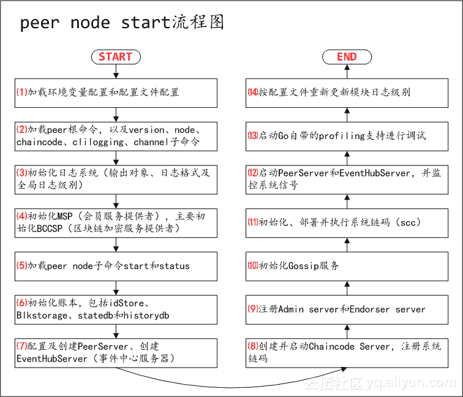

# 区块链教程 Fabric1.0 源代码分析 Peer peer node start 命令实现-兄弟连区块链

> 原文：[https://blog.csdn.net/weixin_34198583/article/details/89593725?ops_request_misc=%257B%2522request%255Fid%2522%253A%2522164835606716782092948464%2522%252C%2522scm%2522%253A%252220140713.130102334.pc%255Fblog.%2522%257D&request_id=164835606716782092948464&biz_id=0&utm_medium=distribute.pc_search_result.none-task-blog-2~blog~first_rank_ecpm_v1~rank_v31_ecpm-28-89593725.nonecase&utm_term=%E5%8C%BA%E5%9D%97%E9%93%BE%E6%95%99%E7%A8%8BFabric1.0](https://blog.csdn.net/weixin_34198583/article/details/89593725?ops_request_misc=%257B%2522request%255Fid%2522%253A%2522164835606716782092948464%2522%252C%2522scm%2522%253A%252220140713.130102334.pc%255Fblog.%2522%257D&request_id=164835606716782092948464&biz_id=0&utm_medium=distribute.pc_search_result.none-task-blog-2~blog~first_rank_ecpm_v1~rank_v31_ecpm-28-89593725.nonecase&utm_term=%E5%8C%BA%E5%9D%97%E9%93%BE%E6%95%99%E7%A8%8BFabric1.0)

　　兄弟连区块链教程 Fabric1.0 源代码分析 Peer peer node start 命令实现，2018 年下半年，区块链行业正逐渐褪去发展之初的浮躁、回归理性，表面上看相关人才需求与身价似乎正在回落。但事实上，正是初期泡沫的渐退，让人们更多的关注点放在了区块链真正的技术之上。

# Fabric 1.0 源代码笔记 之 Peer #peer node start 命令实现



## 1、peer node 加载子命令 start 和 status

peer node 加载子命令 start 和 status，代码如下：

```go
func Cmd() *cobra.Command {
    nodeCmd.AddCommand(startCmd()) //加载子命令 start
    nodeCmd.AddCommand(statusCmd()) //加载子命令 status
    return nodeCmd
}

var nodeCmd = &cobra.Command{
    Use:   nodeFuncName,
    Short: fmt.Sprint(shortDes),
    Long:  fmt.Sprint(longDes),
}
//代码在 peer/node/node.go
```

startCmd()代码如下：
其中 serve(args)为 peer node start 的实现代码，比较复杂，本文将重点讲解。
另 statusCmd()代码与 startCmd()相近，暂略。

```go
func startCmd() *cobra.Command {
    flags := nodeStartCmd.Flags()
    flags.BoolVarP(&chaincodeDevMode, "peer-chaincodedev", "", false, "Whether peer in chaincode development mode")
    flags.BoolVarP(&peerDefaultChain, "peer-defaultchain", "", false, "Whether to start peer with chain testchainid")
    flags.StringVarP(&orderingEndpoint, "orderer", "o", "orderer:7050", "Ordering service endpoint") //orderer
    return nodeStartCmd
}

var nodeStartCmd = &cobra.Command{
    Use:   "start",
    Short: "Starts the node.",
    Long:  `Starts a node that interacts with the network.`,
    RunE: func(cmd *cobra.Command, args []string) error {
        return serve(args) //serve(args)为 peer node start 的实现代码
    },
}
//代码在 peer/node/start.go
```

**注：如下内容均为 serve(args)的代码，即 peer node start 命令执行流程。**

## 2、初始化 Ledger（账本）

初始化账本，即如下一条代码：

```go
ledgermgmt.Initialize()
//代码在 peer/node/start.go
```

ledgermgmt.Initialize()代码展开如下：

```go
func initialize() {
    openedLedgers = make(map[string]ledger.PeerLedger) //openedLedgers 为全局变量，存储目前使用的账本列表
    provider, err := kvledger.NewProvider() //创建账本 Provider 实例
    ledgerProvider = provider
}
//代码在 core/ledger/ledgermgmt/ledger_mgmt.go
```

kvledger.NewProvider()代码如下：

```go
func NewProvider() (ledger.PeerLedgerProvider, error) {
    idStore := openIDStore(ledgerconfig.GetLedgerProviderPath()) //打开 idStore

    //创建并初始化 blkstorage
    attrsToIndex := []blkstorage.IndexableAttr{
        blkstorage.IndexableAttrBlockHash,
        blkstorage.IndexableAttrBlockNum,
        blkstorage.IndexableAttrTxID,
        blkstorage.IndexableAttrBlockNumTranNum,
        blkstorage.IndexableAttrBlockTxID,
        blkstorage.IndexableAttrTxValidationCode,
    }
    indexConfig := &blkstorage.IndexConfig{AttrsToIndex: attrsToIndex}
    blockStoreProvider := fsblkstorage.NewProvider(
        fsblkstorage.NewConf(ledgerconfig.GetBlockStorePath(), ledgerconfig.GetMaxBlockfileSize()),
        indexConfig)

    //创建并初始化 statedb
    var vdbProvider statedb.VersionedDBProvider
    if !ledgerconfig.IsCouchDBEnabled() {
        vdbProvider = stateleveldb.NewVersionedDBProvider()
    } else {
        vdbProvider, err = statecouchdb.NewVersionedDBProvider()
    }

    //创建并初始化 historydb
    var historydbProvider historydb.HistoryDBProvider
    historydbProvider = historyleveldb.NewHistoryDBProvider()
    //构造 Provider
    provider := &Provider{idStore, blockStoreProvider, vdbProvider, historydbProvider}
    provider.recoverUnderConstructionLedger()
    return provider, nil
}
//代码在 core/ledger/kvledger/kv_ledger_provider.go
```

Ledger 更详细内容，参考：Fabric 1.0 源代码笔记 之 Ledger（账本）

## 3、配置及创建 PeerServer、创建 EventHubServer（事件中心服务器）

```go
//初始化全局变量 localAddress 和 peerEndpoint
err := peer.CacheConfiguration() 
peerEndpoint, err := peer.GetPeerEndpoint() //获取 peerEndpoint
listenAddr := viper.GetString("peer.listenAddress") //PeerServer 监听地址
secureConfig, err := peer.GetSecureConfig() //获取 PeerServer 安全配置，是否启用 TLS、公钥、私钥、根证书
//以监听地址和安全配置，创建 Peer GRPC Server
peerServer, err := peer.CreatePeerServer(listenAddr, secureConfig)
//创建 EventHubServer（事件中心服务器）
ehubGrpcServer, err := createEventHubServer(secureConfig)
//代码在 peer/node/start.go
```

func createEventHubServer(secureConfig comm.SecureServerConfig) (comm.GRPCServer, error)代码如下：

```go
var lis net.Listener
var err error
lis, err = net.Listen("tcp", viper.GetString("peer.events.address")) //创建 Listen
grpcServer, err := comm.NewGRPCServerFromListener(lis, secureConfig) //从 Listen 创建 GRPCServer
ehServer := producer.NewEventsServer(
    uint(viper.GetInt("peer.events.buffersize")), //最大进行缓冲的消息数
    viper.GetDuration("peer.events.timeout")) //缓冲已满的情况下，往缓冲中发送消息的超时
pb.RegisterEventsServer(grpcServer.Server(), ehServer) //EventHubServer 注册至 grpcServer
return grpcServer, nil
//代码在 peer/node/start.go
```

pb.RegisterEventsServer(grpcServer.Server(), ehServer)代码如下：

```go
func RegisterEventsServer(s *grpc.Server, srv EventsServer) {
    s.RegisterService(&_Events_serviceDesc, srv) 
}
//代码在 protos/peer/events.pb.go
```

events（事件服务）更详细内容，参考：Fabric 1.0 源代码笔记 之 events（事件服务）

## 4、创建并启动 Chaincode Server，并注册系统链码

代码如下：

```go
ccprovider.EnableCCInfoCache() //ccInfoCacheEnabled = true
//创建 Chaincode Server
//如果 peer.chaincodeListenAddress，没有定义或者定义和 peerListenAddress 相同，均直接使用 peerServer
//否则另行创建 NewGRPCServer 用于 Chaincode Server
ccSrv, ccEpFunc := createChaincodeServer(peerServer, listenAddr)
//Chaincode service 注册到 grpcServer，并注册系统链码
registerChaincodeSupport(ccSrv.Server(), ccEpFunc)
go ccSrv.Start() //启动 grpcServer
//代码在 peer/node/start.go
```

ccSrv, ccEpFunc := createChaincodeServer(peerServer, listenAddr)代码如下：创建 Chaincode Server。

```go
func createChaincodeServer(peerServer comm.GRPCServer, peerListenAddress string) (comm.GRPCServer, ccEndpointFunc) {
    //peer.chaincodeListenAddress，链码容器连接时的监听地址
    cclistenAddress := viper.GetString("peer.chaincodeListenAddress")

    var srv comm.GRPCServer
    var ccEpFunc ccEndpointFunc

    //如果 peer.chaincodeListenAddress，没有定义或者定义和 peerListenAddress 相同，均直接使用 peerServer
    //否则另行创建 NewGRPCServer 用于 Chaincode Server
    if cclistenAddress == "" {
        ccEpFunc = peer.GetPeerEndpoint
        srv = peerServer
    } else if cclistenAddress == peerListenAddress {
        ccEpFunc = peer.GetPeerEndpoint
        srv = peerServer
    } else {
        config, err := peer.GetSecureConfig()
        srv, err = comm.NewGRPCServer(cclistenAddress, config)
        ccEpFunc = getChaincodeAddressEndpoint
    }

    return srv, ccEpFunc
}
//代码在 peer/node/start.go
```

registerChaincodeSupport(ccSrv.Server(), ccEpFunc)代码如下：Chaincode service 注册到 grpcServer。

```go
func registerChaincodeSupport(grpcServer *grpc.Server, ccEpFunc ccEndpointFunc) {
    userRunsCC := chaincode.IsDevMode() //是否开发模式
    ccStartupTimeout := viper.GetDuration("chaincode.startuptimeout") //启动链码容器的超时
    if ccStartupTimeout < time.Duration(5)*time.Second { //至少 5 秒
        ccStartupTimeout = time.Duration(5) * time.Second
    } else {
    }
    //构造 ChaincodeSupport
    ccSrv := chaincode.NewChaincodeSupport(ccEpFunc, userRunsCC, ccStartupTimeout)
    scc.RegisterSysCCs() //注册系统链码
    pb.RegisterChaincodeSupportServer(grpcServer, ccSrv) //service 注册到 grpcServer
}
//代码在 peer/node/start.go
```

ccSrv := chaincode.NewChaincodeSupport(ccEpFunc, userRunsCC, ccStartupTimeout)代码如下：构造 ChaincodeSupport。

```go
var theChaincodeSupport *ChaincodeSupport

func NewChaincodeSupport(getCCEndpoint func() (*pb.PeerEndpoint, error), userrunsCC bool, ccstartuptimeout time.Duration) *ChaincodeSupport {
    //即/var/hyperledger/production/chaincodes
    ccprovider.SetChaincodesPath(config.GetPath("peer.fileSystemPath") + string(filepath.Separator) + "chaincodes")

    pnid := viper.GetString("peer.networkId") //网络 ID
    pid := viper.GetString("peer.id") //节点 ID

    //构造 ChaincodeSupport
    theChaincodeSupport = &ChaincodeSupport{runningChaincodes: &runningChaincodes{chaincodeMap: make(map[string]*chaincodeRTEnv), launchStarted: make(map[string]bool)}, peerNetworkID: 
pnid, peerID: pid}

    ccEndpoint, err := getCCEndpoint() //此处传入 ccEpFunc
    if err != nil {
        theChaincodeSupport.peerAddress = viper.GetString("chaincode.peerAddress")
    } else {
        theChaincodeSupport.peerAddress = ccEndpoint.Address
    }
    if theChaincodeSupport.peerAddress == "" {
        theChaincodeSupport.peerAddress = peerAddressDefault
    }

    theChaincodeSupport.userRunsCC = userrunsCC //是否开发模式
    theChaincodeSupport.ccStartupTimeout = ccstartuptimeout //启动链码容器的超时

    theChaincodeSupport.peerTLS = viper.GetBool("peer.tls.enabled") //是否启用 TLS
    if theChaincodeSupport.peerTLS {
        theChaincodeSupport.peerTLSCertFile = config.GetPath("peer.tls.cert.file")
        theChaincodeSupport.peerTLSKeyFile = config.GetPath("peer.tls.key.file")
        theChaincodeSupport.peerTLSSvrHostOrd = viper.GetString("peer.tls.serverhostoverride")
    }

    kadef := 0
    // Peer 和链码之间的心跳超时，小于或等于 0 意味着关闭
    if ka := viper.GetString("chaincode.keepalive"); ka == "" {
        theChaincodeSupport.keepalive = time.Duration(kadef) * time.Second //0
    } else {
        t, terr := strconv.Atoi(ka)
        if terr != nil {
            t = kadef //0
        } else if t <= 0 {
            t = kadef //0
        }
        theChaincodeSupport.keepalive = time.Duration(t) * time.Second //非 0
    }

    execto := time.Duration(30) * time.Second
    //invoke 和 initialize 命令执行超时
    if eto := viper.GetDuration("chaincode.executetimeout"); eto <= time.Duration(1)*time.Second {
        //小于 1 秒时，默认 30 秒
    } else {
        execto = eto
    }
    theChaincodeSupport.executetimeout = execto

    viper.SetEnvPrefix("CORE")
    viper.AutomaticEnv()
    replacer := strings.NewReplacer(".", "_")
    viper.SetEnvKeyReplacer(replacer)

    theChaincodeSupport.chaincodeLogLevel = getLogLevelFromViper("level")
    theChaincodeSupport.shimLogLevel = getLogLevelFromViper("shim")
    theChaincodeSupport.logFormat = viper.GetString("chaincode.logging.format")

    return theChaincodeSupport
}

//代码在 core/chaincode/chaincode_support.go
```

scc.RegisterSysCCs()代码如下：注册系统链码。

```go
func RegisterSysCCs() {
    //cscc、lscc、escc、vscc、qscc
    for _, sysCC := range systemChaincodes {
        RegisterSysCC(sysCC)
    }
}
代码在 core/scc/importsysccs.go
```

## 5、注册 Admin server 和 Endorser server

代码如下：

```go
//s.RegisterService(&_Admin_serviceDesc, srv)
//var _Admin_serviceDesc = grpc.ServiceDesc{...}
//core.NewAdminServer()构造 ServerAdmin 结构体，ServerAdmin 结构体实现 type AdminServer interface 接口
pb.RegisterAdminServer(peerServer.Server(), core.NewAdminServer())
//构造结构体 Endorser，Endorser 结构体实现 type EndorserServer interface 接口
serverEndorser := endorser.NewEndorserServer()
//s.RegisterService(&_Endorser_serviceDesc, srv)
//var _Endorser_serviceDesc = grpc.ServiceDesc{...}
pb.RegisterEndorserServer(peerServer.Server(), serverEndorser)
//代码在 peer/node/start.go
```

附 type AdminServer interface 接口定义：

```go
type AdminServer interface {
    GetStatus(context.Context, *google_protobuf.Empty) (*ServerStatus, error)
    StartServer(context.Context, *google_protobuf.Empty) (*ServerStatus, error)
    GetModuleLogLevel(context.Context, *LogLevelRequest) (*LogLevelResponse, error)
    SetModuleLogLevel(context.Context, *LogLevelRequest) (*LogLevelResponse, error)
    RevertLogLevels(context.Context, *google_protobuf.Empty) (*google_protobuf.Empty, error)
}
//代码在 protos/peer/admin.pb.go
```

附 type EndorserServer interface 接口定义：

```go
type EndorserServer interface {
    ProcessProposal(context.Context, *SignedProposal) (*ProposalResponse, error)
}
//代码在 protos/peer/peer.pb.go
```

## 6、初始化 Gossip 服务

```go
bootstrap := viper.GetStringSlice("peer.gossip.bootstrap") //启动节点后 gossip 连接的初始节点
serializedIdentity, err := mgmt.GetLocalSigningIdentityOrPanic().Serialize() //获取签名身份
messageCryptoService := peergossip.NewMCS( //构造 mspMessageCryptoService（消息加密服务）
    peer.NewChannelPolicyManagerGetter(), //构造 type channelPolicyManagerGetter struct{}
    localmsp.NewSigner(), //构造 type mspSigner struct {}
    mgmt.NewDeserializersManager()) //构造 type mspDeserializersManager struct{}
secAdv := peergossip.NewSecurityAdvisor(mgmt.NewDeserializersManager()) //构造 mspSecurityAdvisor（安全顾问）

secureDialOpts := func() []grpc.DialOption {
    var dialOpts []grpc.DialOption
    dialOpts = append(dialOpts, grpc.WithDefaultCallOptions(grpc.MaxCallRecvMsgSize(comm.MaxRecvMsgSize()), //MaxRecvMsgSize
        grpc.MaxCallSendMsgSize(comm.MaxSendMsgSize()))) //MaxSendMsgSize
    dialOpts = append(dialOpts, comm.ClientKeepaliveOptions()...) //ClientKeepaliveOptions

    if comm.TLSEnabled() {
        tlsCert := peerServer.ServerCertificate()
        dialOpts = append(dialOpts, grpc.WithTransportCredentials(comm.GetCASupport().GetPeerCredentials(tlsCert)))
    } else {
        dialOpts = append(dialOpts, grpc.WithInsecure())
    }
    return dialOpts
}

err = service.InitGossipService(serializedIdentity, peerEndpoint.Address, peerServer.Server(),
    messageCryptoService, secAdv, secureDialOpts, bootstrap...) //构造 gossipServiceImpl
defer service.GetGossipService().Stop()
//代码在 peer/node/start.go
```

Gossip 更详细内容参考：Fabric 1.0 源代码笔记 之 gossip（流言算法）

## 7、初始化、部署并执行系统链码（scc）

代码如下：

```go
initSysCCs() //初始化系统链码，调用 scc.DeploySysCCs("")
peer.Initialize(func(cid string) { //初始化所有链
    scc.DeploySysCCs(cid) //按 chain id 部署并运行系统链码
})
//代码在 peer/node/start.go
```

func Initialize(init func(string))代码如下：

```go
func Initialize(init func(string)) {
    chainInitializer = init

    var cb *common.Block
    var ledger ledger.PeerLedger
    ledgermgmt.Initialize()
    ledgerIds, err := ledgermgmt.GetLedgerIDs()
    for _, cid := range ledgerIds {
        ledger, err = ledgermgmt.OpenLedger(cid)
        cb, err = getCurrConfigBlockFromLedger(ledger) //获取最新的配置块
        err = createChain(cid, ledger, cb)
        InitChain(cid) //即调用 chainInitializer(cid)，即 scc.DeploySysCCs(cid)
    }
}
//代码在 core/peer/peer.go
```

createChain(cid, ledger, cb)代码如下：

```go
func createChain(cid string, ledger ledger.PeerLedger, cb *common.Block) error {
    envelopeConfig, err := utils.ExtractEnvelope(cb, 0) //获取配置交易
    configtxInitializer := configtx.NewInitializer() //构造 initializer
    gossipEventer := service.GetGossipService().NewConfigEventer() //获取 gossipServiceInstance，并构造 configEventer

    gossipCallbackWrapper := func(cm configtxapi.Manager) {
        ac, ok := configtxInitializer.ApplicationConfig()
        gossipEventer.ProcessConfigUpdate(&chainSupport{
            Manager:     cm,
            Application: ac,
        })
        //验证可疑节点身份，并关闭无效链接
        service.GetGossipService().SuspectPeers(func(identity api.PeerIdentityType) bool {
            return true
        })
    }

    trustedRootsCallbackWrapper := func(cm configtxapi.Manager) {
        updateTrustedRoots(cm)
    }

    configtxManager, err := configtx.NewManagerImpl(
        envelopeConfig,
        configtxInitializer,
        []func(cm configtxapi.Manager){gossipCallbackWrapper, trustedRootsCallbackWrapper},
    )
    mspmgmt.XXXSetMSPManager(cid, configtxManager.MSPManager())

    ac, ok := configtxInitializer.ApplicationConfig()
    cs := &chainSupport{
        Manager:     configtxManager,
        Application: ac, // TODO, refactor as this is accessible through Manager
        ledger:      ledger,
    }

    c := committer.NewLedgerCommitterReactive(ledger, txvalidator.NewTxValidator(cs), func(block *common.Block) error {
        chainID, err := utils.GetChainIDFromBlock(block)
        if err != nil {
            return err
        }
        return SetCurrConfigBlock(block, chainID)
    })

    ordererAddresses := configtxManager.ChannelConfig().OrdererAddresses()
    service.GetGossipService().InitializeChannel(cs.ChainID(), c, ordererAddresses)

    chains.Lock()
    defer chains.Unlock()
    chains.list[cid] = &chain{
        cs:        cs,
        cb:        cb,
        committer: c,
    }
    return nil
}
//代码在 core/peer/peer.go
```

scc 更详细内容参考：Fabric 1.0 源代码笔记 之 scc（系统链码）

## 8、启动 peerServer 和 ehubGrpcServer，并监控系统信号，以及启动 Go 自带的 profiling 支持进行调试

代码如下：

```go
serve := make(chan error)
sigs := make(chan os.Signal, 1)
signal.Notify(sigs, syscall.SIGINT, syscall.SIGTERM)

go func() {
    sig := <-sigs //接收系统信号
    serve <- nil
}

go func() {
    var grpcErr error
    grpcErr = peerServer.Start() //启动 peerServer
    serve <- grpcErr
}

err := writePid(config.GetPath("peer.fileSystemPath")+"/peer.pid", os.Getpid()) //写入 pid

go ehubGrpcServer.Start() //启动 ehubGrpcServer

if viper.GetBool("peer.profile.enabled") {
    go func() { //启动 Go 自带的 profiling 支持进行调试
        profileListenAddress := viper.GetString("peer.profile.listenAddress")
        profileErr := http.ListenAndServe(profileListenAddress, nil)
    }
}

return <-serve //等待 serve
//代码在 peer/node/start.go
```

## 9、按配置文件重新更新模块日志级别

```go
overrideLogModules := []string{"msp", "gossip", "ledger", "cauthdsl", "policies", "grpc"}
for _, module := range overrideLogModules {
    err = common.SetLogLevelFromViper(module)
}
flogging.SetPeerStartupModulesMap()
//代码在 peer/node/start.go
```