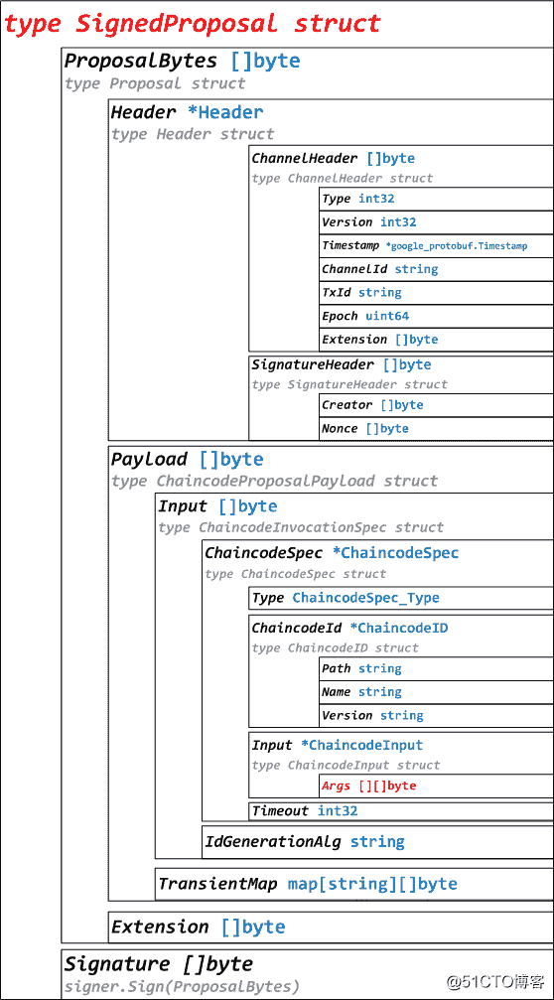

# 区块链教程 Fabric1.0 源代码分析 Proposal（提案）

> 原文：[https://blog.csdn.net/weixin_34313182/article/details/92732234?ops_request_misc=%257B%2522request%255Fid%2522%253A%2522164835607016780269843253%2522%252C%2522scm%2522%253A%252220140713.130102334.pc%255Fblog.%2522%257D&request_id=164835607016780269843253&biz_id=0&utm_medium=distribute.pc_search_result.none-task-blog-2~blog~first_rank_ecpm_v1~rank_v31_ecpm-3-92732234.nonecase&utm_term=%E5%8C%BA%E5%9D%97%E9%93%BE%E6%95%99%E7%A8%8BFabric1.0](https://blog.csdn.net/weixin_34313182/article/details/92732234?ops_request_misc=%257B%2522request%255Fid%2522%253A%2522164835607016780269843253%2522%252C%2522scm%2522%253A%252220140713.130102334.pc%255Fblog.%2522%257D&request_id=164835607016780269843253&biz_id=0&utm_medium=distribute.pc_search_result.none-task-blog-2~blog~first_rank_ecpm_v1~rank_v31_ecpm-3-92732234.nonecase&utm_term=%E5%8C%BA%E5%9D%97%E9%93%BE%E6%95%99%E7%A8%8BFabric1.0)

　　**区块链教程**Fabric1.0 源代码分析 Proposal（提案），2018 年下半年，区块链行业正逐渐褪去发展之初的浮躁、回归理性，表面上看相关人才需求与身价似乎正在回落。但事实上，正是初期泡沫的渐退，让人们更多的关注点放在了区块链真正的技术之上。

# Fabric1.0 源代码笔记之 Proposal（提案）

## 1、Proposal 概述

Proposal，即向 Endorser 发起的提案。
Proposal 代码分布在 protos/utils、protos/peer 目录下，目录结构如下：

protos/utils 目录：
    proputils.go，Proposal 工具函数。
    txutils.go，Proposal 工具函数。
protos/peer 目录：
    proposal.pb.go，Proposal 相关结构体定义。

## 2、Proposal 相关结构体定义



2.1、SignedProposal 定义

```go
type SignedProposal struct {
    ProposalBytes []byte //Proposal 序列化，即 type Proposal struct
    Signature []byte //signer.Sign(ProposalBytes)
}
//代码在 protos/peer/proposal.pb.go
```

### 2.2、Proposal 定义

```go
type Proposal struct {
    Header []byte //Header 序列化，即 type Header struct
    Payload []byte //ChaincodeProposalPayload 序列化，即 type ChaincodeProposalPayload struct
    Extension []byte //扩展
}
//代码在 protos/peer/proposal.pb.go
```

### 2.3、ChaincodeProposalPayload 定义

```go
type ChaincodeProposalPayload struct {
    Input []byte //ChaincodeInvocationSpec 序列化，即 type ChaincodeInvocationSpec struct
    TransientMap map[string][]byte //瞬态映射
}
//代码在 protos/peer/proposal.pb.go
```

## 3、ProposalResponse 结构体定义

### 3.1、ProposalResponse 定义

```go
type ProposalResponse struct {
    Version int32
    Timestamp *google_protobuf1.Timestamp
    Response *Response //type Response struct，peer.Response{Status: 200, Message: "OK"}}
    Payload []byte
    Endorsement *Endorsement //type Endorsement struct
}
//代码在 protos/peer/proposal_response.pb.go
```

### 3.2、Response 定义

```go
type Response struct { //peer.Response{Status: 200, Message: "OK"}}
    Status int32
    Message string
    Payload []byte
}
//代码在 protos/peer/proposal_response.pb.go
```

### 3.3、Endorsement 定义

```go
type Endorsement struct {
    Endorser []byte //bccspmsp.signer
    Signature []byte
}
//代码在 protos/peer/proposal_response.pb.go
```

转载于:https://blog.51cto.com/14041296/2313978